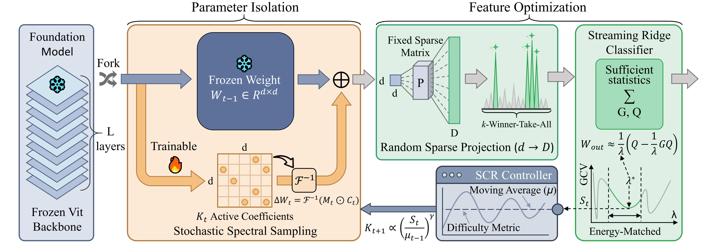

# DSCA: Dual-Space Cooperation with Capacity Adaptive for Continual Learning

<div align="justify">
  This is the official implementation of our ICML 2026 paper "Dual-Space Cooperation with Capacity Adaptive for Continual Learning".
In this paper, we propose a new parameter-efficient continual learning method called Dual-Space Cooperation with Capacity Adaptive (DSCA). 
</div>

## Introduction

<div align="justify">
Exemplar-Free Class-Incremental Learning (EFCIL) demands continuous adaptation to sequential tasks without accessing historical data, addressing critical privacy and storage constraints. While Parameter-Efficient Fine-Tuning (PEFT) offers a viable path, existing paradigms are constrained by inherent design rigidities: they suffer from \textbf{single-space vulnerability} by predominantly prioritizing parameter space isolation while neglecting feature space optimization, and rely on \textbf{static capacity allocation} (e.g., constant ranks), which fails to adapt to varying task complexities. To transcend these limitations, we propose \textbf{Dual-Space Cooperation with Capacity Adaptive (DSCA)}, which unifies dual-space representation defense with data-driven capacity modulation. Specifically, DSCA enforces separation simultaneously within the parameter and feature spaces to eliminate inter-task representations overlap, while concurrently deploying a Statistical Capacity Regulator (SCR) to autonomously modulate the parameter budget based on intrinsic task learnability to prevent intra-task feature entanglement. By transforming the learning process into a robust and dynamic evolution, DSCA achieves state-of-the-art performance on CIFAR-100, ImageNet-R and ImageNet-A, particularly in long task sequences, while maintaining extreme parameter efficiency.
</div>



## Requisite

This code is implemented in PyTorch, and we perform the experiments under the following environment settings:

- python = 3.8
- torch = 1.10.0
- torchvision = 0.11.1
- timm = 0.6.7

## Install
```
conda env create -f environment.yaml
```
I think the code can run under other versions of the environment, but I haven't tried.


## Dataset preparation
 * Create a folder `data/`
 * **CIFAR 100**: should automatically be downloaded
 * **ImageNet-R**: download dataset from https://people.eecs.berkeley.edu/~hendrycks/imagenet-r.tar. After unzipping, place it into `data/` folder 
 * **ImageNet-A**: download from /https://drive.usercontent.google.com/download?id=19l52ua_vvTtttgVRziCZJjal0TPE9f2p&export=download&authuser=0&confirm=t&uuid=190d2f51-c20f-4f31-8943-a9b6b34c51dc&at=ANTm3cx79YhHG1XPZ0_fT0wwAy2d%3A1766552998950. After unzipping, place it into `data/` folder 

## Training
All commands should be run under the project root directory. Currently, the code has been validated on 1 3090 GPUs (24G).

### ImageNet-R (10 Tasks):
#### For DSCA
```
python main.py --device your_device --config configs/mimg10_dsca.json 
```

### ImageNet-R (20 Tasks):
#### For DSCA
```
python main.py --device your_device --config configs/mimg20_dsca.json 
```

### ImageNet-R (50 Tasks):
#### For DSCA
```
python main.py --device your_device --config configs/mimg50_dsca.json 
```

### CIFAR100:
#### For DSCA
```
python main.py --device your_device --config configs/cifar100_dsca.json 
```

### ImageNet-A:
#### For DSCA
```
python main.py --device your_device --config configs/mimg_a_dsca.json 
```

## Acknoledgements
We thank the following repos providing helpful components/functions in our work.

- [PyCIL](https://github.com/G-U-N/PyCIL)
- [InfLoRA](https://github.com/liangyanshuo/InfLoRA)


